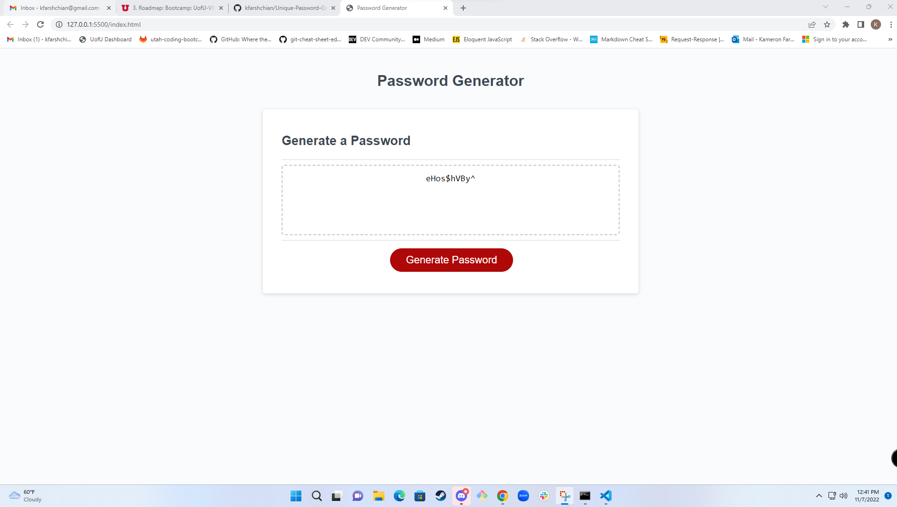

# Unique Password Generator Starter Code

## Description
I was given the code for the website completed with HTML and CSS. The service I provided was to add the JavaScript and make the password generator functional. The password service needed to have an option of 8-128 characters. There should be an option for both lower case or upper case letters, numbers, and special characters. At a minimun one needs to be selected. One the selections are made the password is generated. I had the choice of showing the password as an alert or on the page. 

## Installation

Please add script.js file to old projects missing it. 

## Usage
https://kfarshchian.github.io/Unique-Password-Generator/

## Credits

Xandromus - Starter code - https://github.com/coding-boot-camp/friendly-parakeet

## License

Please refer to the LICENSE in the repo.
